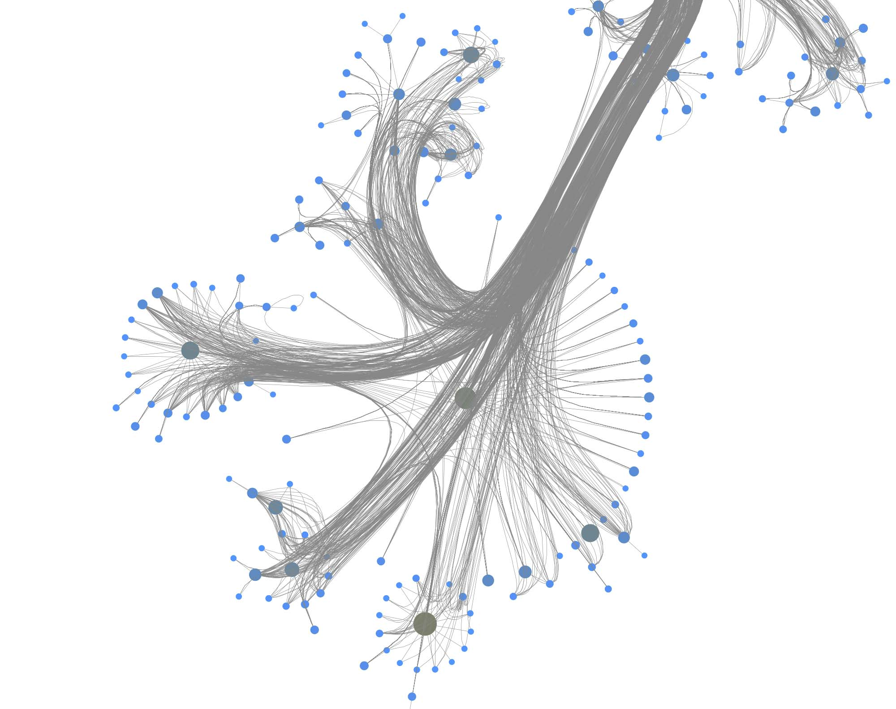

# Drug Repurposing using TigerGraph and Graph Machine Learning

 

**Drug repositioning** (also called **drug repurposing**) involves the investigation of existing drugs for new therapeutic purposes. Through graph analytics and machine learning applied to knowledge graphs, drug repurposing aims to find new uses for already existing and approved drugs. This approach, part of a more general science called in-silico drug discovery, makes it possible to identify serious repurposing candidates by finding genes involved in a specific disease and checking if they interact, in the cell, with other genes which are targets of known drugs
The discovery of new treatments through drug repositioning complements traditional drug development for small markets that include rare diseases. It involves the identification of single or combinations of existing drugs based on human genetics data and network biology approaches represents a next-generation approach that has the potential to increase the speed of drug discovery at a lower cost.

In this article we show in details how a freely available but real-world biomedical knowledge graph (the Drug Repurposing Knowledge Graph or DRKG) can generate compounds for concrete diseases. As an example, we show how to discover new compounds to treat hypertension (high blood pressure). We use [TigerGraph](https://tigergraph.com) as a backend graph database to store the knowledge graph and the newly discovered relationships together with some graph machine learning techniques (in easy to use Python frameworks).

From a bird's eye view:


- **DRKG**: an overview of what the knowledge contains
- **TigerGraph schema**: how to connect and define a schema for the knowledge graph
- **Querying**: how to use the TigerGraph API from Python
- **Data import**: how import the TSV data into TigerGraph
- **Exploration and visualization**: what does the graph look like?
- **Link prediction**: some remarks on how one can predict things without neural networks
- **Drug repurposing the hard way**: possible paths and frameworks
- **Drug repurposing the easy way**: TorchDrug and pretrained vectors to the rescue
- **Repurposing for hypertension**: concrete code to make the world a better place
- **Challenges**: some thoughts and downsides to the method
- **References**: links to books, articles and frameworks
- **Setup**: we highlight the necessary tech you need to make it happen

You will also find a list of references and your feedback is always welcome via [Twitter](https://twitter.com/TheOrbifold), via [the Github repo](https://github.com/Orbifold/drug-repurposing) or via [Orbifold Consulting](https://graphsandnetworks.com). 

_With some special thanks to [Cayley Wetzig](https://www.linkedin.com/in/cayley-wetzig-5bb73512/) for igniting this article._

## Drug Repurposing Knowledge Graph (_DRKG_)

The Drug Repurposing Knowledge Graph (DRKG) is a comprehensive biological knowledge graph relating genes, compounds, diseases, biological processes, side effects and symptoms. DRKG includes information from six existing databases (DrugBank, Hetionet, GNBR, String, IntAct and DGIdb) as well as data collected from recent publications, particularly related to Covid19. It includes **97,238 entities** belonging to 13 entity-types; and **5,874,261 triplets** belonging to 107 edge-types. These 107 edge-types show a type of interaction between one of the 17 entity-type pairs (multiple types of interactions are possible between the same entity-pair), as depicted in the adjacent image.


The DRKG data is [freely available](https://github.com/gnn4dr/DRKG) we explain below how you can import the data into TigerGraph. 

## Creating the schema in TigerGraph

TigerGraph has an integrated schema designer which allows one to design a schema with ease. There is also an API to define a schema via code and since the DRKG schema has lots of edge types between some entities (Compound-Gene has 34, Gene-Gene has 32), it's easier to do it via code. The method below, in fact, allows you to output a schema for any given dataset of triples.

The end-result inside TigerGraph can be seen in the adjacent picture and is identical to the schema above. The many reflexive edges you see are an explicit depiction of the multiple edge count above.


Generating the schema involves the following elements:

1. given the triples collection, we loop over each one to harvest the endpoints (aka head and tail) and name of the relation (aka relation or predicate)
2. the endpoints are in the form "type::id" so we split the string to extract the type and the id
3. each node type and node id are bundled in entity collection
4. the names of the relations are cleaned and put in a separate dictionary.

A typical relation name (e.g. "'DRUGBANK::ddi-interactor-in::Compound:Compound") contains some special characters which are not allowed in a TigerGraph schema. All of these characters are removed but this is the only difference with the initial (raw) data.

Once you have downloaded the dataset you should see a TSV file called "drkg.tsv". This contains all the triples (head-relation-tail) and it can be loaded with a simple Pandas method:

```python
	import pandas as pd
	drkg_file = './drkg.tsv'
	df = pd.read_csv(drkg_file, sep="\t")
	triplets = df.values.tolist()
```

The triplets list is a large array of 5874260 items.

Next, the recipe above output a string which one can execute inside TigerGraph; a schema creation query.

```python
	rtypes = dict() # edge types per entity-couple
	entity_dic = {} # entities organized per type
	for triplet in triplets:
	    [h,r,t] = triplet
	    h_type = h.split("::")[0].replace(" " ,"")
	    h_id = str(h.split("::")[1])
	    t_type = t.split("::")[0].replace(" " ,"")
	    t_id = str(t.split("::")[1])
	    
	    # add the type if not present
	    if not h_type in entity_dic:
	        entity_dic[h_type]={}
	    if not t_type in entity_dic:
	        entity_dic[t_type] ={}
	    
	    # add the edge type per type couple
	    type_edge = f"{h_type}::{t_type}"
	    if not type_edge in rtypes:
	        rtypes[type_edge]=[]
	    r = r.replace(" ","").replace(":","").replace("+","").replace(">","").replace("-","")
	    if not r in rtypes[type_edge]:
	        rtypes[type_edge].append(r)
	    
	    # spread entities
	    if not h_id in entity_dic[h_type]:
	        entity_dic[h_type][h_id] = h
	    if not t in entity_dic[t_type]:
	        entity_dic[t_type][t_id] = t
	    
	schema = ""
	for entity_type in entity_dic.keys():
	    schema += f"CREATE VERTEX {entity_type} (PRIMARY_ID Id STRING) With primary_id_as_attribute=\"true\"\n"
	for endpoints in rtypes:
	    [source_name, target_name] = endpoints.split("::")
	    for edge_name in rtypes[endpoints]:
	        schema += f"CREATE DIRECTED EDGE {edge_name} (FROM {source_name}, TO {target_name})\n"
	print(schema)
```

TigerGraph has excellent documentation and you should read through the ["Defining a graph schema"](https://docs-legacy.tigergraph.com/v/2.3/dev/gsql-ref/ddl-and-loading/defining-a-graph-schema) topic which explains in detail the syntax used in the script above.

The output of this Python snippet ([full listing here](https://gist.github.com/Orbifold/f03daae19e813937f17cffe76e325097)) looks like the following

```

	CREATE VERTEX Gene (PRIMARY_ID Id STRING) With primary_id_as_attribute="true"
	CREATE VERTEX Compound (PRIMARY_ID Id STRING) With primary_id_as_attribute="true"
	...
	CREATE DIRECTED EDGE GNBRZCompoundGene (FROM Compound, TO Gene)
	CREATE DIRECTED EDGE HetionetCbGCompoundGene (FROM Compound, TO Gene)
	...
```

You can use this directly in a GSQL interactive session or via one of the many supported languages. As described in the next section, we'll use Python with the [pyTigerGraph](https://github.com/pyTigerGraph/pyTigerGraph) driver to push the schema.

## Connecting and querying 

Obviously, you need a TigerGraph instance somewhere and if you don't have one around there is no easier way than via the [TigerGraph Cloud.](https://tgcloud.io) 


In the AdminPortal (see image) you should add a secret specific to the database. That is, you can't use a global secret to connect, you need one per database.

Installing the pyTigerGraph drive/package is straightforward (`pip install pyTigerGraph`)  and connecting to the database with the secret looks like the following:

```python
	import pyTigerGraph as tg 
	host = 'https://your-organization.i.tgcloud.io'
	secret = "your-secret"
	graph_name = "drkg"
	user_name = "tigergraph"
	password = "your-password"
	token = tg.TigerGraphConnection(host=host, graphname=graph_name, username=user_name, password=password).getToken(secret, "1000000")[0]
	conn = tg.TigerGraphConnection(host=host, graphname=graph_name, username=user_name, password=password, apiToken=token)
```

This can be condensed to just three lines but the explicit naming of the parameters is to help you get it right.

If all is well you can test the connection with

```python
	conn.echo()
```

which returns "Hello GSQL". With this connection you can now use the full breadth of the GSQL query language.

In particular, we can now create the schema assembled above with this:


```
print(conn.gsql(
"""
	use global
	CREATE VERTEX Gene (PRIMARY_ID Id STRING) With primary_id_as_attribute="true"
	CREATE VERTEX Compound (PRIMARY_ID Id STRING) With primary_id_as_attribute="true"
	...
	CREATE DIRECTED EDGE GNBRZCompoundGene (FROM Compound, TO Gene)
	CREATE DIRECTED EDGE HetionetCbGCompoundGene (FROM Compound, TO Gene)
	...
""")	
```

The content is a copy of the outputted string plus an extra statement `use global` to generate the schema in the global TigerGraph namespace. It means that the schema elements can be reused across different databases. This feature is something you will not find in any other graph database solution and has far-reaching possibilities to manage data.


To use (part of) the global schema in a specific database you simply have to go into the database schema designer and import the elements from the global schema (see picture).
Note that in the visualization you have a globe-icon to emphasize that a schema element is inherited from the global schema.


## Importing the data
The [Jupyter notebook](https://gist.github.com/Orbifold/68b3add8ccfffb52d41bff2f2aecb3fd) to create the schema as well as to import the data can be found here.

TigerGraph has a wonderful intuitive interface to import data but the DRKG schema contains a lot of loops and the raw TSV has the node type embedded in the triple endpoints. One approach is to develop some ETL to end up with multiple files for each entity type and the relationships. The easier way is to use the REST interface to the database:

```python
	for triplet in triplets:
	    [h,r,t] = triplet
	    h_type = h.split("::")[0].replace(" " ,"")
	    h_id = str(h.split("::")[1])
	    t_type = t.split("::")[0].replace(" " ,"")
	    t_id = str(t.split("::")[1])
	    r = r.replace(" ","").replace(":","").replace("+","").replace(">","").replace("-","")
	    
	    conn.upsertEdge(h_type, h_id, r, t_type, t_id)

```

The `upsertEdge` method also creates the nodes if they are not present already, there is no need to upsert nodes and edges separately. This approach is much easier than the ETL one but the hidden cost is the fact that it engenders 5.8 million REST calls. In any case, creating such a large graph takes time no matter the approach.

If you are only interested in exploring things or you have limited resources, you can sample the graph and create a subgraph of DRKG fitting your needs:

```python
	amount_of_edges = 50000
	triple_count = len(triplets)
	sample = np.random.choice(np.arange(triple_count), amount_of_edges)
	for i in sample:
	    [h,r,t] = triplet
	    h_type = h.split("::")[0].replace(" " ,"")
	    h_id = str(h.split("::")[1])
	    t_type = t.split("::")[0].replace(" " ,"")
	    t_id = str(t.split("::")[1])
	    r = r.replace(" ","").replace(":","").replace("+","").replace(">","").replace("-","")
	    
	    conn.upsertEdge(h_type, h_id, r, t_type, t_id)

```

One neat thing you'll notice is that "Load Data" interface in TigerGraph Studio also shows the import progress if you use the REST API. You see the graph growing (to the entity and edge type level) whether you use the ETL upload or the REST import.

## Exploration and Visualization

If you wonder how the DRKG graph looks like, the 0.01 ratio of node to edges automatically leads to a so-called hairball. The degree histogram confirms this and like many real-world graphs it exhibits a power-law distribution (aka [scale-free network](https://en.wikipedia.org/wiki/Scale-free_network)), meaning that the connectivity is mostly defined through a small set of  large hubs while the mjority of the nodes has a much smaller degree.

To layout the whole graph you can use for instance the wonderful [Rapids library and the force-atlas algorithm](https://docs.rapids.ai/api/cugraph/stable/api_docs/api/cugraph.layout.force_atlas2.force_atlas2.html#cugraph.layout.force_atlas2.force_atlas2) or [Gephi](https://gephi.org) but you will need some patience and the result will look like the image below.


Taking a subset of the whole graph reveals something more pleasing and if you hand it over to [yEd Live](https://www.yworks.com/yed-live/) you'll get something like the following

![[Dragon.jpg|500]]
You can furthermore use degree centrality (or any other centrality measure) to emphasize things and zooming into some of the clusters you can discover gene interactions or particular disease symptoms. Of course, all of this is just exploratory but just like any other machine learning task it's crucial to understand a dataset and gain some intuition.




The DRKG data contains interesting information about COVID (variations). For example, the identifier "Disease::SARS-CoV2 M" refers to ["severe acute respiratory syndrome coronavirus 2 membrane (M) protein" ](https://www.nature.com/articles/s41392-020-00438-7)
and you can use a simple GSQL query 

```
	CREATE QUERY get_covid() FOR GRAPH drkg { 
	    
	  start =   {Disease.*};			  
	  results = SELECT s FROM start:s WHERE s.id=="SARS-CoV2 M";  
	  PRINT results;
	  
	}
```

to fetch the data or use the TigerGraph data explorer. The data explorer having the advantage that you can dril down and use various layout algorithms on the fly.


## Topological Link Predictions

With all the data in the graph database you can start exploring the graph. The TigerGraph GraphStudio offers various click-and-run methods to find shortest paths and other interesting insights. At the same time, the [Graph Data Science Library](https://docs.tigergraph.com/graph-ml/current/intro/) (GDSL) has plenty of methods you can run to discover topological and other characteristics. For example, there are 303 (weakly) connected components and the largest one contains 96420 nodes while the rest are tiny islands of less than 30 nodes. This means that the gross of the data sits in the main component (consisting of 4400229 edges). You can obtain this info using GDSL using the query `RUN QUERY tg_conn_comp(...)` . 

In the same fashion you can run GDSL methods to fetch the k-cores, the page rank and many other standard graph analytical insights. There is also a category entitled "Topological Link Prediction" and although it does what it says it's often not sufficient to for graph completion purposes. There are various reasons for this:

- the word "topological" refers here to the fact that the computation only takes the connectivity into account, not the potential data contained in a node or the payload on an edge. Althoug the DRKG does not have rich data inside the nodes and edges, in general one has molecular information (chemical properties), disease classes and so on. This data is in many cases at least as important as the topological one and to accurately predict new edges (or any other ML task) this data has to be included in the prediction pipeline.
- algorithms like the Jaccard similarity only goes one level deep in searching for similarities. Of course, this has to do with algorithmic efficiency since looping over more than 5 million edges and vertex neighborhoods is demanding. In general, however, the way a node is embedded in a graph requires more than the immediate children/parents of the node. 
- topological link prediction does not infer the edge type or other data, only that an edge 'should' be present in a statistical sense.

At the same time one can question how meaningful it is to implement more advanced machine learning (i.e. neural networks and alike) on a database level. This remark is valid for any database, not just TigerGraph. Whether you use StarDog, SQL Server or Neo4j there some issues with embedding machine learning algorithms in a database:

- training neural networks without the raw power of GPU processing is only possible for small datasets. Embedding graph machine learning in a database implicitly requires a way to integrate Nvidia somewhere.
- whether you need Spark or Dask (or any other distributed processing magic) to get the job done, it leads to a whole lot of packages and requirements. Not mentioning the need to have virtual environments and all that. 
- feature engineering matters and when transforming a graph to another one (or turning it into some tabular/numpy format) you need to store things somewhere. Neo4j for example uses projections (virtual graphs) but it's not a satisfactory solution (one cannot query projections for one).
- there are so many ML algorithms and packages out there that it's hardly possible to consolidate something which will answer to all business needs and graph ML tasks.

This is only to highlight that any data science library within a graph database (query language) has its limitations and that one inevitably needs to resort to a complementary solution outside the database. A typical enterprise architecture with streaming data would entail things like Apache Kafka, Amazon Kinesis, Apache Spark and all that. The general idea is as follows:

- a representative subgraph of the graph database is extracted in function of machine learning
- a model is trained towars the (business) goal: graph classification, link prediction, node tagging and so on
- the model is used outside the graph database (triggered upon new graph data) and returns some new insight
- the insight is integrated into the original graph.

In practice this involves a lot of work and some tricky questions (e.g. how to make sure updates don't trigger the creation of existing edges) but the crux is that like so often a system should be used for what it's made for. 

With respect to drug repurposing using the DRKG graph, altough GSQL is Turing complete and hence in theory capable of running neural networks we will assemble in the next section a pipeline outside TigerGraph and feed the new insights back via a simple upsert thereafter.

## Drug repurposing using Geometric Deep Learning

Graph machine learning is a set of techniques towards various graph-related tasks, to name a few:

- graph classification: assigning a label to a while graph. For instance, determining whether a molecule (seen as a graph) is toxic or not.
- node classification: assigning a label to a given node. For instance, inferring the gender in a social network based on given attributes.
- link prediction (aka graph completion): predicting new edges. For instance, inferring terroristic affiliations based on social interactions and geolocation.

Drug repurposing is a special type of link prediction: it attempts to find edges between compounds and diseases which have not been considered yet. Looking at our DRKG graph it means that we are interested in edges between the Compound and Disease entity types. It doesn't mean that other edges are of no importance. Indeed, a generic link prediction pipeline will discover patterns between arbitrary entities and one can focus equally well on new Gene-Gene interactions or symptoms indicating possible diseases.

Note that there is are many names out there to denote the same thing. Geometric (deep) learning, graph embeddings, graph neural networks, graph machine learning, non-Euclidean ML, graph signal processing... all emphasize different aspects of the same research or technology. They all have in common the use of neural networks to learn patterns in graph-like data.

On a technical level, there are heaps of frameworks and techniques with varying quality and sophistication. For drug repositioning specifically you will find the following valuable:

- [Deep Purpose](https://github.com/kexinhuang12345/DeepPurpose) A deep learning library for compound and protein modeling. 
- [DRKG](https://github.com/gnn4dr/DRKG) The data source also contain various notebooks explaining how to perform various prediction on DRKG.
- [DGL-KE](https://github.com/awslabs/dgl-ke) Based on the [DGL library](https://www.dgl.ai), it focuses in learning large scale knowledge graphs and embeddings.
- [TorchDrug](https://torchdrug.ai) A framework designed for drug discovery.

These high-level frameworks hide a lower-level of complexity where you have more grip on assembling neural nets but it also comes with a learning curve. More specifically, [PyTorch Geometric](https://pytorch-geometric.readthedocs.io), [DGL](https://www.dgl.ai), [StellarGraph](https://www.stellargraph.io) and [TensorFlow Geometric](https://tf-geometric.readthedocs.io) are the most prominent graph machine learning framework.

Crafting and training neural networks is an art and a discipline on its own. It also demands huge processing power if you have any significant dataset. In our case, the DRKG graph with its 5.8 million edges will take you days even with GPU power at your disposal. Still, if you want to train a link prediction model without lots of code, we'll show it the next section how to proceed. Thereafter we'll explain how you can make use of pre-trained models to bypass the demanding training phase and get straight to the drup repositioning.

## How to train a link prediction model using TorchDrug

As highlighted above, you can craft your own neural net but there are nowadays plenty of high-level frameworks easing the process. [TorchDrug](https://torchdrug.ai) is one such framework and it comes with lots of goodies to make one smile. As the name indicates, it's also geared towards drug discovery, protein representation learning and biomedical graph reasoning in general. 

Make sure you have PyTorch installed, as well as Pandas and Numpy. That is

```shell
	conda install pytorch -c pytorch
	conda install pandas numpy

```

TorchDrug has many datasets included by default but not DRKG. It does have Hetionet, which is a subset of DRKG. Creating a dataset is, however, just a dozen lines:

```python

	import torch, os
	from torch.utils import data as torch_data
	from torchdrug import core, datasets, tasks, models, data, utils

	
	class DRKG(data.KnowledgeGraphDataset):
	    """
	    DRKG for knowledge graph reasoning.
	
	    Parameters:
	        path (str): path to store the dataset
	        verbose (int, optional): output verbose level
	    """
	
	    url = "https://dgl-data.s3-us-west-2.amazonaws.com/dataset/DRKG/drkg.tar.gz"	
	    md5 = "40519020c906ffa9c821fa53cd294a76"	
	    def __init__(self, path, verbose = 1):
	        path = os.path.expanduser(path)
	        if not os.path.exists(path):
	            os.makedirs(path)
	        self.path = path	
	        zip_file = utils.download(self.url, path, md5 = self.md5)
	        tsv_file = utils.extract(zip_file, "drkg.tsv")	
	        self.load_tsv(tsv_file, verbose = verbose)
```

From here on you can use the whole API of TorchDrug and training a link prediction, in particular, is as simple as:

```python
	dataset = DRKG("~/data")
	
	lengths = [int(0.8 * len(dataset)), int(0.1 * len(dataset))]
	lengths += [len(dataset) - sum(lengths)]
	train_set, valid_set, test_set = torch_data.random_split(dataset, lengths)
	
	train_set, valid_set, test_set = torch_data.random_split(dataset, lengths)
	print("train: ", len(train_set), "val: ", len(valid_set), "test: ", len(test_set))
	
	model = models.RotatE(num_entity = dataset.num_entity,
	                      num_relation = dataset.num_relation,
	                      embedding_dim = 2048, max_score = 9)
	
	task = tasks.KnowledgeGraphCompletion(model, num_negative = 256,
	                                      adversarial_temperature = 1)
	
	optimizer = torch.optim.Adam(task.parameters(), lr = 2e-5)
	solver = core.Engine(task, train_set, valid_set, test_set, optimizer,
	                      batch_size = 1024)
	solver.train(num_epoch = 200)
```

First, a an instance of the DRKG dataset is created and it will automatically download the data to the specified directory (here, in the user's directory `~/data`) if not present already.
Like any other ML task, a split of the data into training, validation and test happens next. Note that splitting a graph into separate sets is in general a non-trivial task due to edges having to be dropped in order to separate a graph. In this case, the raw data is a simple list of triples and the split is, hence, just an array split.

A semantic triple consists of a subject, a predicate and an object. This corresponds, respectively, to the three parts of an arrow: head, link and tail. In ML context you often will see `(h,r,t)` rather than the semantic `(s,p,o)` notation but the two are equivalent.

The `rotatE` model is an embedding of the graph using [relational rotation in complex space as described here](https://arxiv.org/pdf/1902.10197.pdf). TorchDrug has various embedding algorithms and you can read also more about this in [a related article we wrote with Tomaz Bratnic](https://towardsdatascience.com/knowledge-graph-completion-with-pykeen-and-neo4j-6bca734edf43). This embedding step is effectively where the neural net 'learns' to recognize patterns in the graph.

The link prediction task `KnowledgeGraphCompletion` uses the patterns recognized in the model to make predictions. This high-level method hides the tricky parts you need to master if you assemble a net manually.

Finally, the net is trained and this does not differ much from any Torch learning loop (or any other deep learning process for that matter). The number of epochs refers to how many times the data is 'seen' by the net and a single epoch can take up to an hour with a K80 Nvidia GPU. The large number of edges is of course the culprit here. If you want to fully train the net with an acceptable accuracy (technically, a cross-entropy below 0.2) you will need patience or a special budget. This is the reason that pretrained models are a great shortcut and the situation is similar, for example, with NLP transformers like GPT3 where it often doesn't make sense to train a model from scratch but rather make stylistic variations of an existing one.

## Drug repositioning the easy way

Just like there are various pre-trained models for NLP tasks, you can find embeddings for public datasets like DRKG. A pre-trained model for DRKG consists of vectors for each node and each edge, representing the graph elements in a (high-dimensional) vector space (also know as latent space). These embeddings can exist on their own without the need to deserialize the data back into a model, like the `rotatE` model above. The (node or edge) vectors effectively capture all there is to know about both the way they sit in the graph (i.e. purely topological information) and their payload (attributes or properties). Typcally, the more two vectors are similar, the more the nodes are similar in a conceptual sense. There are many ways to define 'similar' just like there are many ways to define distance in a topological vector space but this is beyond the scope of this article.

To be concrete, we'll focus on finding new compounds to treat [hypertension](https://en.wikipedia.org/wiki/Hypertension). In the DRKG graph this corresponds to node with identifier "Disease::DOID:10763".

The possible edges can have one of the following two labels:

```python
	allowed_labels = ['GNBR::T::Compound:Disease','Hetionet::CtD::Compound:Disease']
``````

Furthermore, we will only accept [FDA approved compounds ](https://www.fda.gov/drugs/development-approval-process-drugs/drug-approvals-and-databases)  to narrow down the options:

```python
	allowed_drug = []  
	with open("./FDAApproved.tsv", newline='', encoding='utf-8') as csvfile:  
	    reader = csv.DictReader(csvfile, delimiter='\t', fieldnames=['drug','ids'])  
	    for row_val in reader:  
	        allowed_drug.append(row_val['drug'])
```

giving around 2100 possible compounds.

Pretrained models (well, models and graphs in general) don't work well with concrete names but have numerical identifiers, so one needs a mapping between an actual entity name and a numerical identifier. So, you'll often find a pretrained model file sitting next to a coupld of dictionaries:

```
	# path to the dictionaries
	entity_to_id = './entityToId.tsv'
	relation_to_id = './relationToId.tsv'
	
	entity_name_to_id = {}
	entity_id_to_name = {}
	relation_name_to_id = {}
	
	with open(entity_to_id, newline='', encoding='utf-8') as csvfile:
	    reader = csv.DictReader(csvfile, delimiter='\t', fieldnames=['name','id'])
	    for row_val in reader:
	        entity_name_to_id[row_val['name']] = int(row_val['id'])
	        entity_id_to_name[int(row_val['id'])] = row_val['name']
	
	with open(relation_to_id, newline='', encoding='utf-8') as csvfile:
	    reader = csv.DictReader(csvfile, delimiter='\t', fieldnames=['name','id'])
	    for row_val in reader:
	        relation_name_to_id[row_val['name']] = int(row_val['id'])
	
	
	allowed_drug_ids = []
	disease_ids = []
	for drug in allowed_drug:
	    allowed_drug_ids.append(entity_name_to_id[drug])
	
	for disease in what_diseases:
	    disease_ids.append(entity_name_to_id[disease])
	
	allowed_relation_ids = [relation_name_to_id[treat]  for treat in allowed_labels]

```

Now we are good to load the pretrained vectors

```
	entity_emb = np.load('./entity_vectors.npy')
	rel_emb = np.load('./relation_vectors.npy')
	
	allowed_drug_ids = torch.tensor(allowed_drug_ids).long()
	disease_ids = torch.tensor(disease_ids).long()
	allowed_relation_ids = torch.tensor(allowed_relation_ids)
	
	allowed_drug_tensors = torch.tensor(entity_emb[allowed_drug_ids])
	allowed_relation_tensors = [torch.tensor(rel_emb[rid]) for rid in allowed_relation_ids]
```

The entity embedding consists of 97238 vectors, matching the amount of nodes in DRKG. Complementary to this, the relation embedding consists of 107 for the 107 types of edges in DRKG. The hypertension node identifer is 83430 corresponding to "Disease::DOID:10763" label.

The embeddings can now be used with a standard (Euclidean) metric but to differentiate fitness it's often more convenient to use a measure which penalizes long distances. It's a bit like molcular interaction forces (the so-called [Lennard-Jones potential](https://en.wikipedia.org/wiki/Lennard-Jones_potential))where only the short range matters. This scoring measure (shown In the plot below) quickly diverges beyond a threshold which can be set to accept more or fewer drugs. In the context of differential geometry one would speak of curvature as a measure of deficit between two parallel transports. If the deficit vector is within the threshold neighborhood it's accepted as a treatment, otherwise the score quickly fades to large values. The fact that the score is negative is simply an easy way to sort the results. The closer the score it to zero the more it's a perfect fit to treat hypertension.


In code this idea is simply this:

```
	threshold= 20
	def score(h, r, t):
	    return fn.logsigmoid(threshold - torch.norm(h + r - t, p=2, dim=-1))
	
	allowed_drug_scores = []
	drug_ids = []
	for relation_tensor in range(len(allowed_relation_tensors)):
	    rel_vector = allowed_relation_tensors[relation_tensor]
	    for disease_id in disease_ids:
	        disease_vector = entity_emb[disease_id]
	        drug_score = score(allowed_drug_tensors, rel_vector, disease_vector)
	        allowed_drug_scores.append(drug_score)
	        drug_ids.append(allowed_drug_ids)
	scores = torch.cat(allowed_drug_scores)
	drug_ids = torch.cat(drug_ids)
```

Finally, the compound/drugs found are collected and the identifier converted back to actual labels. The result is

```
	Compound::DB00584	-1.883488948806189e-05
	Compound::DB00521	-2.2053474822314456e-05
	Compound::DB00492	-2.586808113846928e-05
	Compound::DB00275	-2.6464111215318553e-05
	Compound::DB00869	-2.6702524337451905e-05
	Compound::DB00524	-2.8609820219571702e-05
	Compound::DB00421	-2.8967437174287625e-05
	Compound::DB00722	-2.9682672902708873e-05
	Compound::DB00528	-3.0397906812140718e-05
	Compound::DB00612	-3.0874729418428615e-05
```

and the most likely candidate is [Enalapril](https://go.drugbank.com/drugs/DB00584) (DB00584 is the DrugBank Accession Number) which can be checked as a actual drug to treat hypertension. 

You should note that with the code above you **only have to alter the disease identifier** to extract a prediction for that particular disease. Using the [Drug Bank](https://www.drugbank.com) you can look up the Accession Number, if necessary. 

Another important things to emphasize is **the sheer speed with which predictions are made** thanks to the pretrained vectors. In effect, you can hook this up via triggers to automatically make prediction when the knowledge graph is changed. Such a setup would be similar to what one designs for [fraud detection](https://www.about-fraud.com/wp-content/uploads/2020/10/TigerGraph-Detecting-Financial-Fraud-5.pdf) and, in general, realtime anomaly detection of transactions. Feeding back the link predictions to TigerGraph is really just a REST call away.

## Challenges

The small amount of code necessary to achieve all this hides a lot of sophisticated machine learning under the hood. To correctly design and train a graph machine learning pipeline on top of DRKG requires, as mentioned earlier, a lot of time and GPU power. Although the knowledge graph contains plenty of valuable information, it's all topological. That is, the nodes and edges don't contain any data and a much more refined drug repurposing model would be possible if e.g. molecular properties, symptom details and other data would be included. This would, however, engender the creation of more complext neural net and more data would mean longer training times (more epochs).

There are also a number of non-technical downsides to drug repositioning:

- the **dosage** required for the treatment of a disease usually differs from that of its original target disease, and if this happens, the discovery team will have to begin from Phase I clinical trials. This effectively strips drug repurposing of its advantages over classic drug discovery.
- no matter how big the knowledge graph is, nothing replaces the **expertise and scientific know-how** of professionals. Obviously, one shouldn't narrow down the discovery of treatments and compounds to an algorithm. Graph machine learning is an incentive, not a magic wand.
- **patent right issues** can be very complicated for drug repurposing due to the lack of experts in the legal area of drug repositioning, the disclosure of repositioning online or via publications, and the extent of the novelty of the new drug purpose. See the article "[Overcoming the legal and regulatory barriers to drug repurposing](https://www.nature.com/articles/nrd.2018.92)" for a good overview.

 
## References

Books:

- [Computational methods for drug repurposing](https://www.amazon.com/Computational-Methods-Repurposing-Molecular-Biology/dp/1493989545) A compilation of articles for researchers.
- [Surviving Cancer, COVID-19, and Disease: The Repurposed Drug Revolution](https://www.amazon.com/Surviving-Cancer-COVID-19-Disease-Repurposed/dp/0998055425/) Drug repurpose success story (take it with a bit of salt).
- [Graph Representation Learning](https://www.amazon.com/Representation-Learning-Synthesis-Artificial-Intelligence/dp/1681739631) Short and well-written overview.
- [Graph Machine Learning](https://www.amazon.com/Graph-Machine-Learning-techniques-algorithms/dp/1800204493/) Code-first book for developers.

Articles:
- [Drug repurposing: progress, challenges and recommendations](https://www.nature.com/articles/nrd.2018.168) An easy to read _Nature Reviews_ survey.
- [Cancer drug discovery by repurposing: teaching new tricks to old dogs](https://pubmed.ncbi.nlm.nih.gov/23928289/) Describes the repurposing of existing drugs for cancer treatment.
- [Machine and deep learning approaches for cancer drug repurposing](https://pubmed.ncbi.nlm.nih.gov/31904426/) A review of methods towards cancer biology as well as immunomodulation.
- [Drug Repurposing from an Academic Perspective](https://www.ncbi.nlm.nih.gov/pmc/articles/PMC3285382/) Valuable criticism and observations around the methodology as a whole.
- [Overcoming the legal and regulatory barriers to drug repurposing](https://www.nature.com/articles/nrd.2018.92) Drug repurposing has not been as widely realized as hoped, in part owing to legal and regulatory barriers.
TigerGraph:

- [TigerGraph for developers](https://dev.tigergraph.com) Dev info and the [GSQL documentation](https://docs.tigergraph.com/gsql-ref/current/intro/intro) in particular.
- [TigerGraph Cloud](https://tgcloud.io) Get your free graph database in the cloud.
- [TigerGraph Youtube Channel](https://www.youtube.com/channel/UCnSOlBNWim68MYzcKbEswCA) Plenty of explanations to learn from and business cases to admire.
Data:

- [DRKG](https://github.com/gnn4dr/DRKG) The 5.8 million triples a click away.
- [Drug Bank](https://www.drugbank.com) Drug database and more.
- [Clinical Trials](https://www.clinicaltrials.gov/ct2/home) ClinicalTrials.gov is a database of privately and publicly funded clinical studies conducted around the world.

Frameworks:

- [Deep Purpose](https://github.com/kexinhuang12345/DeepPurpose) A Deep Learning Library for Compound and Protein Modeling 
DTI, Drug Property, PPI, DDI, Protein Function Prediction.
- [DGL](https://www.dgl.ai) Easy deep learning on graphs.
- [TorchDrug](https://torchdrug.ai) Easy drug discovery (and much more).
- [StellarGraph](https://stallargraph.io) Wonderful generic graph machine learning package.
- [PyTorch Geometric](https://pytorch-geometric.readthedocs.io) Pretty much the _de facto_ deep learning framework.
- [TensorFlow Geometric](https://tf-geometric.readthedocs.io) Similar to PyTorch, but a bit late to the party (ie. more recent and less mature).


## Setup

All the files you need are in the [Github repo](https://github.com/Orbifold/drug-repurposing) except for the two files containing the pretrained vectors ([you can find them here](https://drive.google.com/drive/folders/1PqBEYVUmJ0INuGXo7lp9SPFrO0vpoQDi?usp=sharing)). 

Make sure you have Python installed (at least 3.8 and at least 3.9 if you have Apple Silicon) as well as TorchDrug, Numpy and Pandas. Of course, you better have all this in a separate environment.

```shell
    conda create --name repurpose python=3.9
    conda activate repurpose
    conda install numpy pandas pyTigerGraph
    conda install pytorch -c pytorch
    pip install torchdrug
    conda install jupyter
```

Create [a free TigerGraph database](https://tgcloud.io) and for this database create a secret as described above. Check that you can connect to your database with something like this


```python
    import pyTigerGraph as tg
    host = 'https://your-organization.i.tgcloud.io'
    secret = "your-secret"
    graph_name = "drkg"
    user_name = "tigergraph"
    password = "your-password"
    token = tg.TigerGraphConnection(host=host, graphname=graph_name, username=user_name, password=password).getToken(secret, "1000000")[0]
    conn = tg.TigerGraphConnection(host=host, graphname=graph_name, username=user_name, password=password, apiToken=token)
    conn.echo()
```
You don't have to download the DRKG data if you use the `torchDrugModel.py` file since it will download it for you. If you want to download the data to upload to TigerGraph, use [this file](https://dgl-data.s3-us-west-2.amazonaws.com/dataset/DRKG/drkg.tar.gz).

The `CreateSchema.ipynb` notebook will help you upload the TigerGraph schema and the `hypertensionRepositioning.ipnb` notebook contains the code described in this article.


